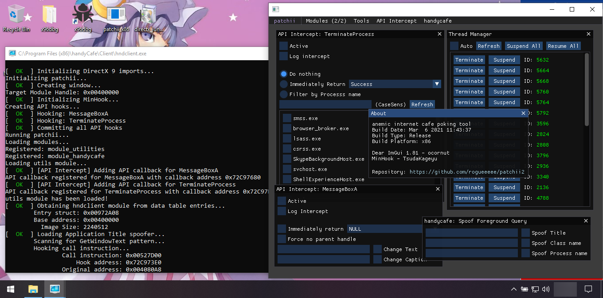
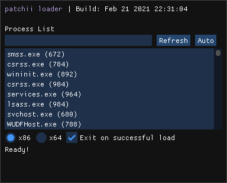

# patchii2

<table>
    <tr>
        <td></td>
        <td><b>patchii2</b> module based anemic internet cafe poking tool</td>
    </tr>
</table>

[Features](#Features) • [Usage](#Usage) • [Change Logs](change_logs.md) • [Development](development.md) • [Module Development](module_dev.md) • [License](#License) • [Libraries](#Libraries) • [Credits](#Credits)

Contributions through PR's are always welcome, check the [Issues](https://github.com/rogueeeee/patchii2/issues) page for things that you might be able to help with.

## Features

Utilities module (utils)

* Thread Manager
    * Suspend
    * Resume
    * Terminate

* Windows API Intercept: TerminateProcess
    * Log calls
    * Immediately return
    * Filter by process name

* Windows API Intercept: MessageBoxA
    * Log calls
    * Immediately respond
    * Disable parent window handle
    * Modify text and caption

handyCafe module (handycafe)

* Spoof
    * Foreground Query
        * Application Title
        * Application Class Name
        * Application Process Name

## Usage
* Requires [DirectX 9](https://github.com/rogueeeee/patchii2/releases/tag/directx_installer) to be installed.

1. Run the patchii loader
2. Select the target process
    * An "*auto*" button is available to automatically detect the process name based off a predefined list
3. Set the client platform to use
    * If the target is a 32 bit application use x86
    * If the target is a 64 bit application use x64
4. Press Load

## License
[GNU General Public License 3.0](https://www.gnu.org/licenses/gpl-3.0.en.html)

## Libraries
* [Dear IMGui](https://github.com/ocornut/imgui) - ocornut
* [MinHook](https://github.com/TsudaKageyu/minhook) - TsudaKageyu

## Credits
* [Patchouli Image](https://www.deviantart.com/fantastiic/art/Chibi-Patchouli-Knownledge-Touhou-305044472) - fantastiic
