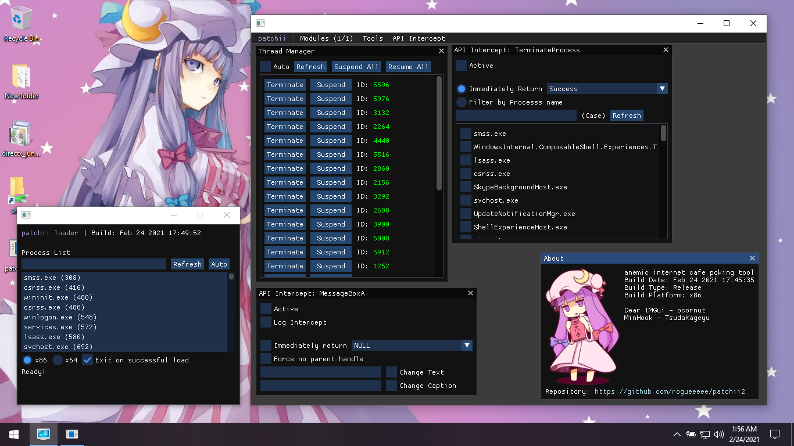
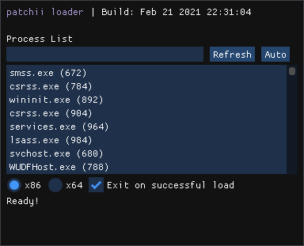

# patchii2




<table>
    <tr>
        <td></td>
        <td><b>patchii2</b><br>module based anemic internet cafe poking tool</td>
    </tr>
</table>

[Features](#Features) • [Usage](#Usage) • [Development](#Development) • [Module Development](#Module-Development) • [License](#License) • [Libraries](#Libraries) • [Credits](#Credits)

Contributions through PR's are always welcome, check the [Issues](https://github.com/rogueeeee/patchii2/issues) page for things that you might be able to help with.

## Features

<details>
<summary>Utilities module (utils)</summary>

* Thread Manager
    * Suspend
    * Resume
    * Terminate

* Windows API Intercept: TerminateProcess
    * Log calls
    * Immediately return
    * Filter by process name

* Windows API Intercept: MessageBoxA
    * Log calls
    * Immediately respond
    * Disable parent window handle
    * Modify text and caption

</details>

<details>
<summary>handyCafe module (handycafe)</summary>

* Spoofer
    * Application Title

</details>

## Usage
* Requires [DirectX 9](https://github.com/rogueeeee/patchii2/releases/tag/directx_installer) to be installed.


1. Run the patchii loader
2. Select the target process
    * An "*auto*" button is available to automatically detect the process name based off a predefined list
3. Set the client platform to use
    * If the target is a 32 bit application use x86
    * If the target is a 64 bit application use x64
4. Press Load

## Development
Information:
* [Repository Branches](#Repository-Branches) - The different branches that exist for this repository and what they are for.
* [Project Structure](#Project-Structure) - Brief description of what each folder in the project is for.

Develoment:
* [Prerequisite](#Prerequisite) - Requirements for the project
* [Cloning](#Cloning) - Creating a local repository of the project (Copying/Downloading the source)
* [Setup](#Setup) - Setting up the project
* [Building](#Building) - Building the entire project to produce the final binary

### Repository-Branches
| Name                                                        | Description                                               |
| ----------------------------------------------------------- | --------------------------------------------------------- |
| [master](https://github.com/rogueeeee/patchii2/tree/master) | Main branch of the repo where all changes are committed   |
| [stable](https://github.com/rogueeeee/patchii2/tree/stable) | Branch where only stable states of the repo is committed  |

### Project-Structure

| Directory    | Description                                                                                                                    |
| ------------ | ------------------------------------------------------------------------------------------------------------------------------ |
| client\      | Contains the main client that gets loaded to a target process, mainly contains all the features, implementations, and modules. |
| docs\        | Contains the project documentation.                                                                                            |
| impl_gui\    | Contains GUI Implementation of Win32 GUI, DirectX, and IMGui. Allows quick creation of GUI applications.                       |
| injector\    | Contains the injector project used for loading the client DLL to the process                                                   |
| loader\      | Contains the loader project used for selecting the target process and deploying the appropriate injector for the target        |
| thirdparty\  | Contains 3rd-Party code and libraries.                                                                                         |
| utils\       | Contains general purpose utility code/libraries.                                                                               |

### Prerequisite
* Windows
* [DirectX SDK](https://www.microsoft.com/en-ph/download/details.aspx?id=10568)
* [Visual Studio 2019](https://visualstudio.microsoft.com/)

### Cloning
* This requires [git](https://git-scm.com/download/win) to be installed
1. Open a command prompt
2. Change directory to where you want to clone the repository
3. Execute the command `git clone https://github.com/rogueeeee/patchii2.git`

### Setup
* Project can be accessed through the solution file (**patchii2.sln**) in Visual Studio. Most of the things are already configured.
* It is recommended to use the **Show All Files** view mode for the Solution Explorer.


### Building
[Auto Build](#Auto-Build) • [Client](#Building-Client) • [Injector](#Building-Injector) • [Loader](#Building-Loader)

You can switch to the *stable* branch of the repository for stability, This can be done by executing the command `git switch stable`.

#### Auto-Build
A python script is provided to automatically setup the required binary headers and build the entire project.
* Prerequisite:
    * [Python 3](https://www.python.org/downloads/windows/) must be installed.
    * The **msbuild** directory should be included in your environment's path variable
1. Open a command prompt
2. Change directory into the folder

    ```bat
    cd /d <some directory>\patchii2
    ```

3. Run the build script

    ```bat
    py autobuild.py
    ```

4. The final compiled binaries (patchii loader) should be located at **build\final**

#### Building-Client
1. Locate the **client** project and select it, configure it to your target build, and then start the build.

#### Building-Injector
1. Locate the **injector** project and select it.
2. Setup the binary headers by creating 2 header files **injector\binaries\bin_x86.h** and **injector\binaries\bin_x64.h**
    * These header files are not included and are excluded from the repository as they contain binaries.
3. Dump the client DLL's into C arrays and place the binary array inside an **unsigned char** array named **client_bin**
    * [Dumping to binary using HxD](#Dumping-to-binary-using-HxD)
    * **injector\binaries\bin_x86.h** and **injector\binaries\bin_x64.h** should now contain something similar to:
    
        ```c++
        #pragma once

        unsigned char client_bin[] = {
            // This is an example, the dumped hex arrays will be different for different cases
	        0x00, 0x00, 0x00, 0x00, 0x00, 0x00, 0x00, 0x00, 0x2E, 0x74, 0x65, 0x78,
	        0x74, 0x00, 0x00, 0x00, 0x54, 0x71, 0x05, 0x00, 0x00, 0x10, 0x00, 0x00,
	        0x00, 0x72, 0x05, 0x00, 0x00, 0x04, 0x00, 0x00, 0x00, 0x00, 0x00, 0x00,
	        0x00, 0x00, 0x00, 0x00, 0x00, 0x00, 0x00, 0x00, 0x20, 0x00, 0x00, 0x60,
	        0x2E, 0x72, 0x64, 0x61, 0x74, 0x61, 0x00, 0x00, 0x74, 0x74, 0x01, 0x00,
	        0x00, 0x90, 0x05, 0x00, 0x00, 0x76, 0x01, 0x00, 0x00, 0x76, 0x05, 0x00,
            // etc...
        }
        ```

    * Make sure to dump the appropriate DLL builds to the appropriate platform header (eg. **build\Release_Win32\patchii_client.dll** to **injector\binaries\bin_x86.h**).
    * It's recommended to use client release builds.
4. Configure it to your target build, and then start the build.

#### Building-Loader
1. Locate the **loader** project and select it.
2. Setup the binary headers by creating 2 header files **loader\binaries\inj_binary_x86.h** and **loader\binaries\inj_binary_x64.h**
    * These header files are not included and are excluded from the repository as they contain binaries.
3. Dump the injector executable into C arrays and place the binary array inside an **unsigned char** array named **inj_bin_x86** for **loader\binaries\inj_binary_x86.h** and **inj_bin_x64** for **loader\binaries\inj_binary_x64.h**
    * [Dumping to binary using HxD](#Dumping-to-binary-using-HxD)
    
    * **loader\binaries\inj_binary_x86.h** and **loader\binaries\inj_binary_x64.h** should now contain something similar to:
    
        ```c++
        #pragma once

        unsigned char inj_bin_x86[] = {
            // This is an example, the dumped hex arrays will be different for different cases
	        0x00, 0x00, 0x00, 0x00, 0x00, 0x00, 0x00, 0x00, 0x2E, 0x74, 0x65, 0x78,
	        0x74, 0x00, 0x00, 0x00, 0x54, 0x71, 0x05, 0x00, 0x00, 0x10, 0x00, 0x00,
	        0x00, 0x72, 0x05, 0x00, 0x00, 0x04, 0x00, 0x00, 0x00, 0x00, 0x00, 0x00,
	        0x00, 0x00, 0x00, 0x00, 0x00, 0x00, 0x00, 0x00, 0x20, 0x00, 0x00, 0x60,
	        0x2E, 0x72, 0x64, 0x61, 0x74, 0x61, 0x00, 0x00, 0x74, 0x74, 0x01, 0x00,
	        0x00, 0x90, 0x05, 0x00, 0x00, 0x76, 0x01, 0x00, 0x00, 0x76, 0x05, 0x00,
            // etc...
        }
        ```

        ```c++
        #pragma once

        unsigned char inj_bin_x64[] = {
            // This is an example, the dumped hex arrays will be different for different cases
	        0x00, 0x00, 0x00, 0x00, 0x00, 0x00, 0x00, 0x00, 0x2E, 0x74, 0x65, 0x78,
	        0x74, 0x00, 0x00, 0x00, 0x54, 0x71, 0x05, 0x00, 0x00, 0x10, 0x00, 0x00,
	        0x00, 0x72, 0x05, 0x00, 0x00, 0x04, 0x00, 0x00, 0x00, 0x00, 0x00, 0x00,
	        0x00, 0x00, 0x00, 0x00, 0x00, 0x00, 0x00, 0x00, 0x20, 0x00, 0x00, 0x60,
	        0x2E, 0x72, 0x64, 0x61, 0x74, 0x61, 0x00, 0x00, 0x74, 0x74, 0x01, 0x00,
	        0x00, 0x90, 0x05, 0x00, 0x00, 0x76, 0x01, 0x00, 0x00, 0x76, 0x05, 0x00,
            // etc...
        }
        ```

    * Make sure to dump the appropriate DLL builds to the appropriate platform header (eg. **build\Release_Win32\patchii_client.dll** to **injector\binaries\bin_x86.h**).
    * It's recommended to use client release builds.
4. Configure it to your target build, and then start the build.

##### Dumping-to-binary-using-HxD
* You can use tools like [HxD](https://mh-nexus.de/en/hxd/) to dump the binary files into C arrays
    

## Module-Development
All modules are implemented in **client\modules**.

**Note: When adding or creating directories and C++ files for your module it's recommended to do it through Visual Studio (from the solution explorer)**.

1. Create a directory for your module to keep the modules folder clean.
    * eg. *"**client\modules\example_module**"*
2. Inside the directory you can implement your module's C++ files however you want, but it would be better to name them after your module.
    * eg.  **client\modules\example_module\example_module.h** and **client\modules\example_module\example_module.cpp**
3. Create your own implementation of the module base class (**patchii_module_base**) by including **client\patchii_module_base.h**.
    * Make sure to use the **override** keyword when you're implementing one of the functions.
    * Read [Module Interface](#Module-Interface) for extensive documentation on what each virtual function is used for.
    * Note: Some functions are optional to override.
    * **example_module.h**
        ```c++
        #include <client/patchii_module_base.h>

        class example_module : public patchii_module_base
        {
        public:
        	example_module();

        public:
        	virtual bool load() override;
        	virtual bool unload() override;
        	virtual bool is_loaded() override;
        };
        ```

    * **example_module.cpp** - Use the initializer list of your module's constructor to call the *patchii_module_base*'s constructor to set the name of your module.
        ```c++
        #include "example_module.h"

        example_module::example_module()
            : patchii_module_base("example") // Your module's name
        {
        }
        ```

4. Register the module in **client\modules\modules.cpp** by including your module's header then locate the function definition of patchii_get_registered_modules() then declare your module inside the vector array named **preload** using the **patchii_register_module(*module name*)** macro.
    * Example (This is an example, *client\modules\modules.cpp* may change overtime and some parts are removed to make this small):
        ```c++
        #include "modules.h"

        #include "example_module/example_module.h" // Include your module's header

        std::vector<patchii_module_base *> patchii_get_registered_modules()
        {
        	std::vector<std::pair<patchii_module_base *, const char *>> preload =
        	{
        		patchii_register_module(example_module) // Register it by adding it to the preload
        	};
        }
        ````

### Module-Interface

| Virtual function                 | Optional  | Load Required | Description                                                                                                                                                                                |
| ---------------------------------|:---------:|:-------------:| ------------------------------------------------------------------------------------------------------------------------------------------------------------------------------------------ |
| bool load()                      | Depends   | No            | Called when patchii is loading the module. Return **true** if the module successfuly loaded and **false** otherwise.                                                                       |
| bool unload()                    | Depends   | Yes           | Called when patchii is unloading the module. Return **true** if the module successfuly unloaded and **false** otherwise.                                                                   |
| bool is_loaded()                 | No        | No            | Called when patchii is querying whether the module is loaded or not. Return **true** if the module is loaded and **false** if its unloaded.                                                |
| void draw_imgui_tools()          | Yes       | Yes           | Called when patchii is drawing the tools menu item in the main menu bar. Used for drawing custom ImGui controls in the **Tools** main menu item.                                           |
| void draw_imgui_mainmenubar()    | Yes       | Yes           | Called when patchii is drawing the main menu bar. Used for drawing custom ImGui controls in the main menu bar.                                                                             |
| void draw_imgui_module_options() | Yes       | No            | Called when patchii is drawing the options for the current module. Used for adding extra options aside from the **Load** and **Unload** in the **Modules** menu item in the main menu bar. |
| void draw_imgui()                | Yes       | Yes           | Called when patchii is drawing other ImGui controls. Used for general purpose drawing. (Windows, UI, etc...)                                                                               |
| void update()                    | Yes       | Yes           | Called when patchii is running its update cycle / main loop. Used for general purpose code execution.                                                                                      |
| void dxreset()                   | Yes       | Yes           | Called when DirectX device reset is called.                                                                                                                                                |

## License
[GNU General Public License 3.0](https://www.gnu.org/licenses/gpl-3.0.en.html)

## Libraries
* [Dear IMGui](https://github.com/ocornut/imgui) - ocornut
* [MinHook](https://github.com/TsudaKageyu/minhook) - TsudaKageyu

## Credits
* [Patchouli Image](https://www.deviantart.com/fantastiic/art/Chibi-Patchouli-Knownledge-Touhou-305044472) - fantastiic