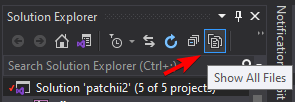
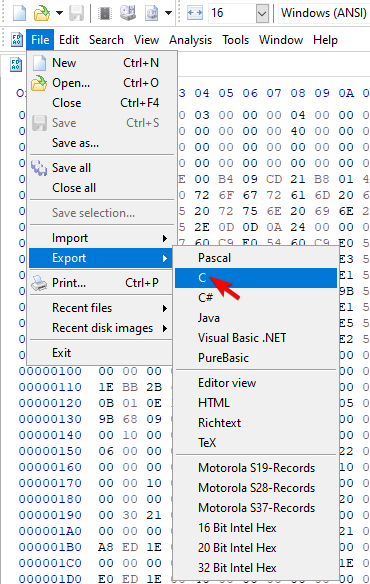

# Development
Information:
* [Repository Branches](#Repository-Branches) - The different branches that exist for this repository and what they are for.
* [Project Structure](#Project-Structure) - Brief description of what each folder in the project is for.

Development:
* [Prerequisite](#Prerequisite) - Requirements for the project
* [Cloning](#Cloning) - Creating a local repository of the project (Copying/Downloading the source)
* [Setup](#Setup) - Setting up the project
* [Building](#Building) - Building the entire project to produce the final binary

## Repository-Branches
| Name                                                                  | Description                                                                                                      |
| --------------------------------------------------------------------- | ---------------------------------------------------------------------------------------------------------------- |
| [master](https://github.com/rogueeeee/patchii2/tree/master)           | Main branch of the repository, mostly merged from the development branch after finalizing the current dev branch |
| [development](https://github.com/rogueeeee/patchii2/tree/development) | Development branch of the repository, This is where all the changes are pushed until finalization                |

## Project-Structure

| Directory    | Description                                                                                                                    |
| ------------ | ------------------------------------------------------------------------------------------------------------------------------ |
| client\      | Contains the main client that gets loaded to a target process, mainly contains all the features, implementations, and modules. |
| docs\        | Contains the project documentation.                                                                                            |
| impl_gui\    | Contains GUI Implementation of Win32 GUI, DirectX, and IMGui. Allows quick creation of GUI applications.                       |
| injector\    | Contains the injector project used for loading the client DLL to the process                                                   |
| loader\      | Contains the loader project used for selecting the target process and deploying the appropriate injector for the target        |
| thirdparty\  | Contains 3rd-Party code and libraries.                                                                                         |
| utils\       | Contains general purpose utility code/libraries.                                                                               |

## Prerequisite
* Windows
* [DirectX SDK](https://www.microsoft.com/en-au/download/details.aspx?id=6812)
* [Visual Studio 2019](https://visualstudio.microsoft.com/)

## Cloning
* This requires [git](https://git-scm.com/download/win) to be installed
1. Open a command prompt
2. Change directory to where you want to clone the repository
3. Execute the command `git clone https://github.com/rogueeeee/patchii2.git`

## Setup
* Project can be accessed through the solution file (**patchii2.sln**) in Visual Studio. Most of the things are already configured.
* It is recommended to use the **Show All Files** view mode for the Solution Explorer.



## Building
[Build script](#Build-Script) • [Client](#Building-Client) • [Injector](#Building-Injector) • [Loader](#Building-Loader)

### Build-Script
A python script is provided to automatically setup the required binary headers and build the entire project.
* Prerequisite:
    * [Python 3](https://www.python.org/downloads/windows/) must be installed.
    * The **msbuild** directory should be included in your environment's path variable

**Usage:**
1. Open a command prompt
2. Change directory into the folder

    ```bat
    cd /d <some directory>\patchii2
    ```

3. Run the build script

    ```bat
    py build.py <optional parameters>
    ```

    | Parameter     | Description                                                                      |
    | ------------- | -------------------------------------------------------------------------------- |
    | -noupx / -upx | Toggles UPX compression after full build.                                        |
    | -bd.client    | Sets the build depth to 0. Only builds the client project.                       |
    | -bd.injector  | Sets the build depth to 1. Only builds the client and injector project.          |
    | -bd.loader    | Sets the build depth to 2. Only builds the client, injector, and loader project. |
    | -bd.full      | Sets the build depth to maximum. Builds the entire project.                      |

4. The final compiled binaries (patchii loader) should be located at **build\final**

### Building-Client
1. Locate the **client** project and select it, configure it to your target build, and then start the build.

### Building-Injector
1. Locate the **injector** project and select it.
2. Setup the binary headers by creating 2 header files **injector\binaries\bin_x86.h** and **injector\binaries\bin_x64.h**
    * These header files are not included and are excluded from the repository as they contain binaries.
3. Dump the client DLL's into C arrays and place the binary array inside an **unsigned char** array named **client_bin**
    * [Dumping to binary using HxD](#Dumping-to-binary-using-HxD)
    * **injector\binaries\bin_x86.h** and **injector\binaries\bin_x64.h** should now contain something similar to:
    
        ```c++
        #pragma once

        unsigned char client_bin[] = {
            // This is an example, the dumped hex arrays will be different for different cases
	        0x00, 0x00, 0x00, 0x00, 0x00, 0x00, 0x00, 0x00, 0x2E, 0x74, 0x65, 0x78,
	        0x74, 0x00, 0x00, 0x00, 0x54, 0x71, 0x05, 0x00, 0x00, 0x10, 0x00, 0x00,
	        0x00, 0x72, 0x05, 0x00, 0x00, 0x04, 0x00, 0x00, 0x00, 0x00, 0x00, 0x00,
	        0x00, 0x00, 0x00, 0x00, 0x00, 0x00, 0x00, 0x00, 0x20, 0x00, 0x00, 0x60,
	        0x2E, 0x72, 0x64, 0x61, 0x74, 0x61, 0x00, 0x00, 0x74, 0x74, 0x01, 0x00,
	        0x00, 0x90, 0x05, 0x00, 0x00, 0x76, 0x01, 0x00, 0x00, 0x76, 0x05, 0x00,
            // etc...
        }
        ```

    * Make sure to dump the appropriate DLL builds to the appropriate platform header (eg. **build\Release_Win32\patchii_client.dll** to **injector\binaries\bin_x86.h**).
    * It's recommended to use client release builds.
4. Configure it to your target build, and then start the build.

### Building-Loader
1. Locate the **loader** project and select it.
2. Setup the binary headers by creating 2 header files **loader\binaries\inj_binary_x86.h** and **loader\binaries\inj_binary_x64.h**
    * These header files are not included and are excluded from the repository as they contain binaries.
3. Dump the injector executable into C arrays and place the binary array inside an **unsigned char** array named **inj_bin_x86** for **loader\binaries\inj_binary_x86.h** and **inj_bin_x64** for **loader\binaries\inj_binary_x64.h**
    * [Dumping to binary using HxD](#Dumping-to-binary-using-HxD)
    
    * **loader\binaries\inj_binary_x86.h** and **loader\binaries\inj_binary_x64.h** should now contain something similar to:
    
        ```c++
        #pragma once

        unsigned char inj_bin_x86[] = {
            // This is an example, the dumped hex arrays will be different for different cases
	        0x00, 0x00, 0x00, 0x00, 0x00, 0x00, 0x00, 0x00, 0x2E, 0x74, 0x65, 0x78,
	        0x74, 0x00, 0x00, 0x00, 0x54, 0x71, 0x05, 0x00, 0x00, 0x10, 0x00, 0x00,
	        0x00, 0x72, 0x05, 0x00, 0x00, 0x04, 0x00, 0x00, 0x00, 0x00, 0x00, 0x00,
	        0x00, 0x00, 0x00, 0x00, 0x00, 0x00, 0x00, 0x00, 0x20, 0x00, 0x00, 0x60,
	        0x2E, 0x72, 0x64, 0x61, 0x74, 0x61, 0x00, 0x00, 0x74, 0x74, 0x01, 0x00,
	        0x00, 0x90, 0x05, 0x00, 0x00, 0x76, 0x01, 0x00, 0x00, 0x76, 0x05, 0x00,
            // etc...
        }
        ```

        ```c++
        #pragma once

        unsigned char inj_bin_x64[] = {
            // This is an example, the dumped hex arrays will be different for different cases
	        0x00, 0x00, 0x00, 0x00, 0x00, 0x00, 0x00, 0x00, 0x2E, 0x74, 0x65, 0x78,
	        0x74, 0x00, 0x00, 0x00, 0x54, 0x71, 0x05, 0x00, 0x00, 0x10, 0x00, 0x00,
	        0x00, 0x72, 0x05, 0x00, 0x00, 0x04, 0x00, 0x00, 0x00, 0x00, 0x00, 0x00,
	        0x00, 0x00, 0x00, 0x00, 0x00, 0x00, 0x00, 0x00, 0x20, 0x00, 0x00, 0x60,
	        0x2E, 0x72, 0x64, 0x61, 0x74, 0x61, 0x00, 0x00, 0x74, 0x74, 0x01, 0x00,
	        0x00, 0x90, 0x05, 0x00, 0x00, 0x76, 0x01, 0x00, 0x00, 0x76, 0x05, 0x00,
            // etc...
        }
        ```

    * Make sure to dump the appropriate injector builds to the appropriate platform header (eg. **build\Release_Win32\patchii_injector.exe** to **injector\binaries\bin_x86.h**).
    * It's recommended to use injector release builds.
4. Configure it to your target build, and then start the build.

#### Dumping-to-binary-using-HxD
* You can use tools like [HxD](https://mh-nexus.de/en/hxd/) to dump the binary files into C arrays

